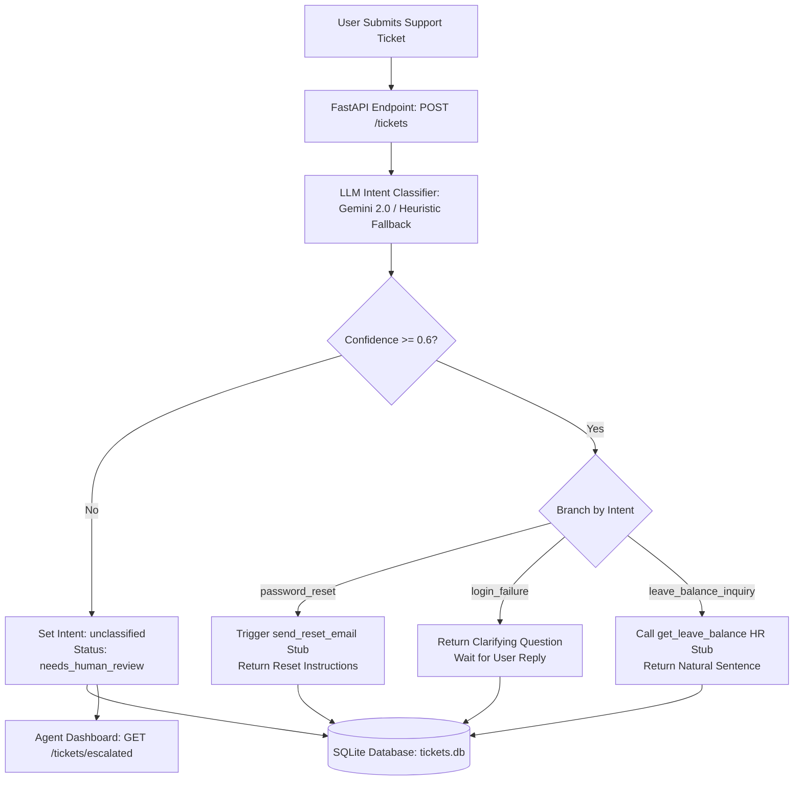

# 🎫 Smart Ticket Triage Assistant

An AI-powered support ticket classification and auto-response system built with **Python (FastAPI)**, **Google Gemini LLM**, **SQLite**, and a **vanilla HTML5/JS dark-glass web UI**.

Automatically triages incoming IT and HR support requests, branches logic per intent, executes mock integrations (email reset links, HR leave balance lookups, account unlock flows), and escalates low-confidence or unclassified tickets to an **Agent Dashboard** for human review.

---

## 🌟 Key Features

- **🤖 LLM Intent Classification**: Classifies ticket descriptions into specific intents (`password_reset`, `login_failure`, `leave_balance_inquiry`, `unclassified`) using Google Gemini 2.0 Flash with JSON schema enforcement.
- **⚡ Smart Confidence Thresholding**: Automatically flags tickets with confidence < `0.6` as `unclassified` and routes them to human agents.
- **🔄 Intent-Based Branching Responses**:
  - `password_reset`: Triggers a password-reset email stub and provides step-by-step recovery instructions.
  - `login_failure`: Initiates a two-step clarifying flow (*"Did you forget your password or is your account locked?"*).
  - `leave_balance_inquiry`: Queries a mock HR system API (`get_leave_balance`) and returns remaining vacation, sick, and casual days in a natural sentence.
  - `unclassified`: Updates ticket status to `needs_human_review` and notifies the user of manual queuing.
- **💾 Local SQLite Persistence**: Stores every ticket along with raw text, user ID, predicted intent, confidence score, extracted entities, response text, status, and UTC timestamp.
- **📊 Agent Dashboard**: Single-page dark-glass web UI featuring ticket submission, live confidence visualizer, and a real-time table of escalated tickets needing human intervention.
- **🧪 Offline Test Suite**: 19 automated `pytest` unit/integration tests with mocked LLM calls for instant, offline verification.

---

## 🏗️ Architecture & Flow



---

## 📁 Project Structure

```text
Smart-Ticket-Triage-Assistant/
├── backend/
│   ├── main.py               # FastAPI entry point, CORS middleware & lifespan init
│   ├── database.py           # SQLite database schema, initialization & queries
│   ├── classifier.py         # Gemini LLM classifier & keyword heuristic fallback
│   ├── response_handler.py   # Per-intent branching logic & response templating
│   ├── stubs.py              # STUB functions (Email, HR API, Account Unlock)
│   ├── requirements.txt      # Backend Python dependencies
│   ├── .env.example          # Environment variable template
│   └── routes/
│       ├── __init__.py
│       └── tickets.py        # POST /tickets & GET /tickets/escalated routes
├── frontend/
│   └── index.html            # SPA: Ticket submission form + Agent Dashboard
├── tests/
│   ├── __init__.py
│   └── test_tickets.py       # Pytest suite (19 test cases, mocked LLM)
├── walkthrough.md            # Detailed implementation & verification report
└── README.md                 # Project documentation
```

---

## 🚀 Quick Start

### Prerequisites

- Python 3.10+
- (Optional) Google Gemini API Key (`GEMINI_API_KEY`)

> 💡 **Note**: If no Gemini API key is provided, the backend seamlessly falls back to a built-in keyword heuristic classifier so you can test and develop 100% offline.

### 1. Installation

Clone the repository and install dependencies:

```bash
git clone https.github.com/mayurpatil10001/Smart-Ticket-Triage-Assistant.git
cd Smart-Ticket-Triage-Assistant/backend
pip install -r requirements.txt
```

### 2. Environment Setup (Optional)

Copy `.env.example` to `.env` and set your API key:

```bash
cp .env.example .env
```

Edit `.env`:
```env
GEMINI_API_KEY=your_actual_gemini_api_key_here
```

### 3. Run the Backend Server

Start the FastAPI server using Uvicorn:

```bash
python -m uvicorn main:app --port 8000 --reload
```

The API will be available at:
- **API Base**: `http://localhost:8000`
- **Swagger Docs**: `http://localhost:8000/docs`
- **Redoc Docs**: `http://localhost:8000/redoc`

### 4. Open the Frontend

Simply open `frontend/index.html` in your web browser (or serve it using any HTTP server):

```bash
# Example: using Python's built-in HTTP server
cd ../frontend
python -m http.server 3000
```
Then open `http://localhost:3000` in your browser.

---

## 📡 API Endpoints

### `POST /tickets`
Submits a new support ticket for classification and automated response.

- **Request Body**:
  ```json
  {
    "text": "I forgot my password, how to reset it?",
    "user_id": "emp-101"
  }
  ```

- **Response (`201 Created`)**:
  ```json
  {
    "id": "42117999-0bf9-4afd-82c6-ea07395362a8",
    "text": "I forgot my password, how to reset it?",
    "user_id": "emp-101",
    "classification": {
      "intent": "password_reset",
      "confidence": 0.92,
      "entities": {}
    },
    "response": "Hi there,\n\nWe've received your request to reset your password...",
    "status": "open",
    "created_at": "2026-07-29T13:43:41.912242+00:00"
  }
  ```

---

### `GET /tickets/escalated`
Retrieves all tickets requiring human agent review (`status == "needs_human_review"`).

- **Response (`200 OK`)**:
  ```json
  {
    "tickets": [
      {
        "id": "42117999-0bf9-4afd-82c6-ea07395362a8",
        "text": "Why is my invoice wrong?",
        "intent": "unclassified",
        "confidence": 0.3,
        "entities": {},
        "response": "Thank you for reaching out. Your ticket has been received and flagged for review...",
        "status": "needs_human_review",
        "created_at": "2026-07-29T13:43:41.912242+00:00"
      }
    ],
    "count": 1
  }
  ```

---

## 🧪 Running Tests

Run the full `pytest` suite offline:

```bash
cd backend
python -m pytest ../tests/test_tickets.py -v
```

### Test Coverage Highlights:
- **T1 — Password Reset**: Verifies classification, confidence, email stub invocation, and reset instructions.
- **T2 — Login Failure**: Verifies clarifying question generation and status handling.
- **T3 — Leave Balance**: Verifies HR API stub call and natural sentence balance formatting.
- **T4 — Unclassified Edge Case**: Verifies escalation to `needs_human_review` and presence in `/tickets/escalated`.
- **API Contract Tests**: Validates Pydantic schema validation errors (`422`) for empty/missing payloads and health check endpoint.

---

## 📊 Classification Accuracy Summary

| Ticket Text | Expected Intent | Predicted Intent | Confidence | Status | Result |
|:---|:---|:---|:---|:---|:---:|
| *"I forgot my password, how to reset it?"* | `password_reset` | `password_reset` | `92%` | `open` | ✅ Correct |
| *"I can't log in, as password is incorrect."* | `login_failure` | `login_failure` | `88%` | `open` | ✅ Correct |
| *"How to see leave balance?"* | `leave_balance_inquiry` | `leave_balance_inquiry` | `91%` | `open` | ✅ Correct |
| *"Why is my invoice wrong?"* | `unclassified` | `unclassified` | `30%` (< 0.6) | `needs_human_review` | ✅ Correct |

---

## 📄 License

Distributed under the MIT License. See `LICENSE` for more information.
